<h1>시연 시나리오</h1>

<h2>카카오 소셜 로그인 및 회원가입</h2>

* 카카오 로그인

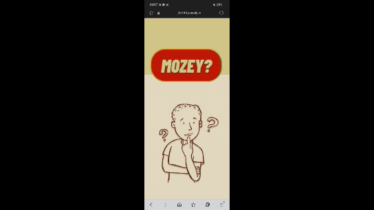

<h2>마이페이지</h2>

* 마이페이지에서 친구 추가

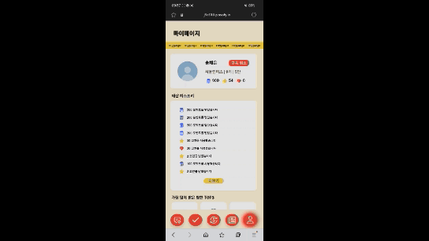

* 질문 신청

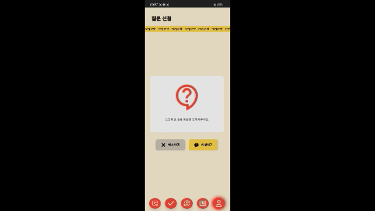

* 질문 신청 내역

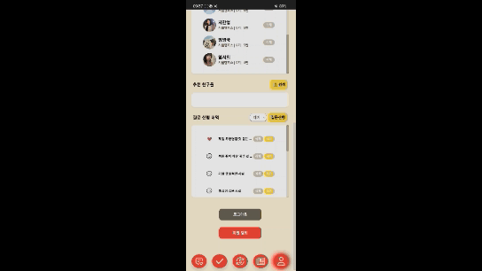

* 구독

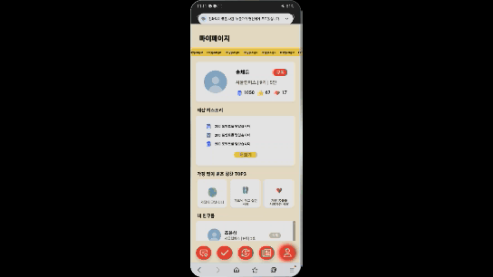

<h2>투표</h2>

* 질문에 해당하는 친구 투표 및 포인트 획득

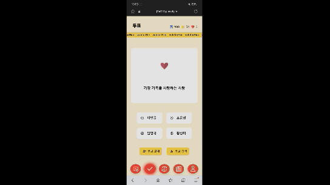

* 투표 횟수 제한

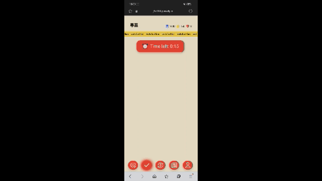

<h2>교환소</h2>

* 주가 확인

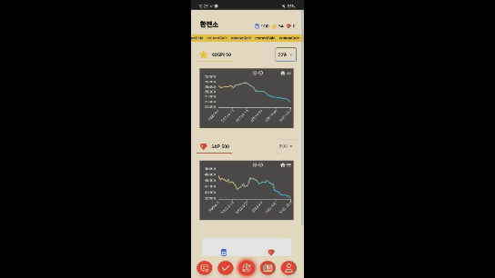

* 재화 환전

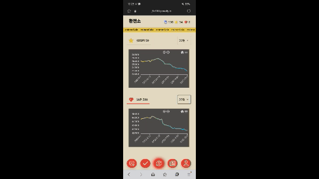

<h2>뉴스</h2>

* 뉴스를 읽고, 퀴즈 풀이

<h2>칭찬 메시지함 및 알림 기능</h2>

* 투표 받은 칭찬 메시지함 확인

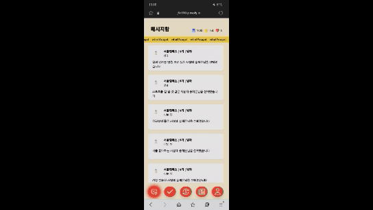

* 재화 부족

* 투표자 확인

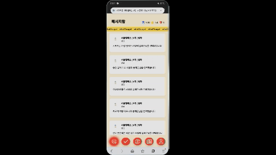

